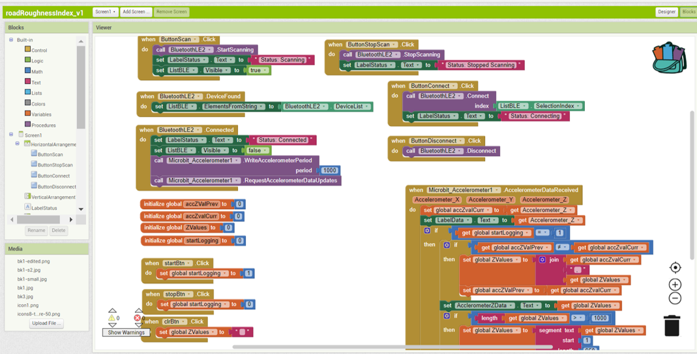
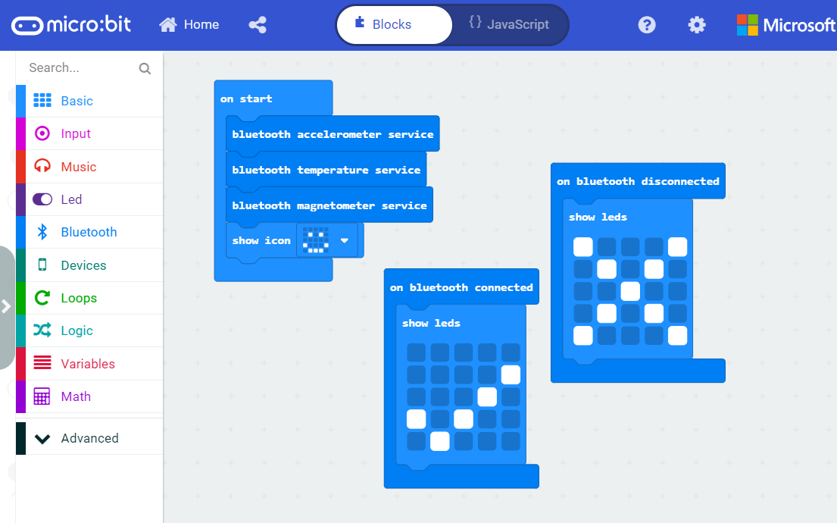

# Road Roughness Index Calculation using Micro:bit

App is built using MIT App Invector 2. This repository contains .aia file which is a format used by MIT App Inventor (.aia stands for App Inventor Archive).

## Idea

Micro:bit device has an accelerometer sensor which will be mounted on any moving vehicle. The readings of the sensor are transmitted to the android application via Bluetooth and displayed on the screen. The variation in readings of the z-axis on the accelerometer sensor can be used to calculate an estimate of the roughness of the road. This data can help us decide which roads need mend and which don't. It can even act as a tool to evaluate the contractor's job.

## Animation to convey idea
https://github.com/architjain11/Road-Roughness-Index/assets/63463358/00556cf0-bf93-48d8-8268-dd137335187b

## App screenshot

## App Inventor 2 Interface

## App Code

## Micro:bit Code

